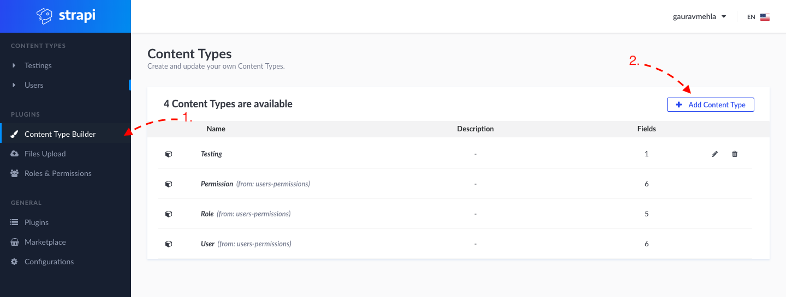
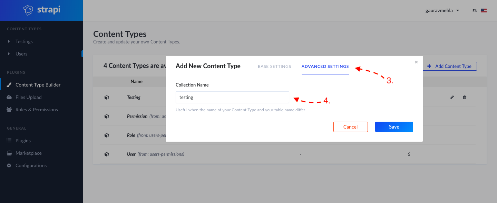
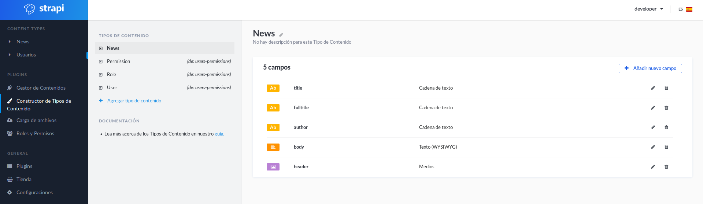
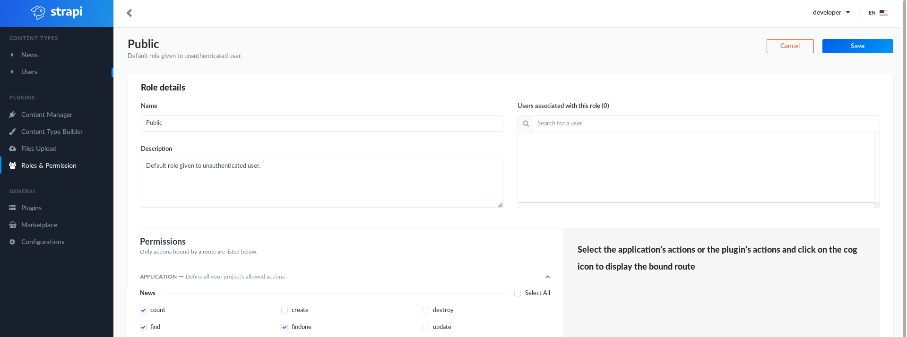

# website-template

This repository contains the structure of a generic React app.

# Build and run the image

With `Docker` and `Docker-compose` installed, run:

```
$ docker-compose up --build
```

The `docker-compose.yml` file defines three containers:

* `web-app` for the web-application, bootstrapped with [Create React App](https://github.com/facebook/create-react-app).
* `strapi-app` for [Strapi](https://strapi.io/), a headless Content Management Framework, front-end agnostic, with an admin panel.
* `strapi-db` for MongoDB, a document-oriented database used by Strapi.

Docker will also import a dump from MongoDB which contains some example contents, generated by running:

```
$ docker exec -it <STRAPI-DB_CONTAINER_ID> bash
$ root@<STRAPI-DB_CONTAINER_ID>:/# mongodump -o /dump/
$ root@<STRAPI-DB_CONTAINER_ID>:/# exit
$ docker cp <STRAPI-DB_CONTAINER_ID>:/dump .
```

Strapi will *not load* by default the collections from the existing MongoDB, so we will have to do it manually when configuring the app for the first time (**these steps are optional if you are running `docker-compose` with the `volumes` folder**):

1. Log-in into Strapi (default credentials `developer:developer`) and add a new Content Type:



2. In Advance Section, add `News` as collection name (as it should be the same name as in the database). In the Base Section you can give any name to this collection.



3. Make sure to add all the following fields with correct field-types (note: `title` and `fulltitle` are mandatory fields):



4. Add the following permissions to the `Public` role:



# App project

## Available Scripts

After running

```
npm install
```

in the project directory, you can run the following commands:

> The node.js package includes both `node` and `npm` executables.

### `npm start`

Runs the app in development mode.<br>
Open [http://localhost:3000](http://localhost:3000) to view it in the browser.

The page will reload if you make edits.<br>
You will also see any lint errors in the console.

### `npm run build`

Builds the app for production to the `build` folder.<br>
It correctly bundles React in production mode and optimizes the build for the best performance.

The build is minified and the filenames include the hashes.<br>
Your app is ready to be deployed!

## Deployment

`npm run build` creates a `build` directory with a production build of your app. Set up your favorite HTTP server so that a visitor to your site is served `index.html`, and requests to static paths like `/static/js/main.<hash>.js` are served with the contents of the `/static/js/main.<hash>.js` file.

### Static Server

For environments using [Node](https://nodejs.org/), the easiest way to handle this would be to install [serve](https://github.com/zeit/serve) and let it handle the rest:

```sh
npm install -g serve
serve -s build
```

The last command shown above will serve your static site on the port **5000**. Like many of [serve](https://github.com/zeit/serve)’s internal settings, the port can be adjusted using the `-p` or `--port` flags.

Run this command to get a full list of the options available:

```sh
serve -h
```

### Other Solutions

You don’t necessarily need a static server in order to run a Create React App project in production. It works just as fine integrated into an existing dynamic one.

Here’s a programmatic example using [Node](https://nodejs.org/) and [Express](http://expressjs.com/):

```javascript
const express = require('express');
const path = require('path');
const app = express();

app.use(express.static(path.join(__dirname, 'build')));

app.get('/', function(req, res) {
  res.sendFile(path.join(__dirname, 'build', 'index.html'));
});

app.listen(9000);
```

The choice of your server software isn’t important either. Since Create React App is completely platform-agnostic, there’s no need to explicitly use Node.

The `build` folder with static assets is the only output produced by Create React App.

However this is not quite enough if you use client-side routing (i.e. if you want to support URLs like `/todos/42` in your single-page app).

